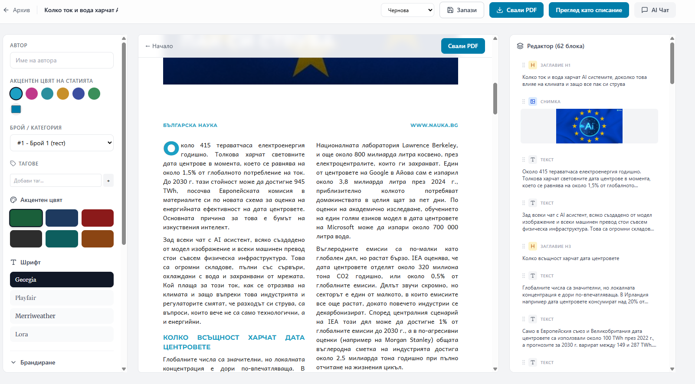

# Open Magazine Studio

**Turn a pasted or uploaded article into a consistent, print‑ready magazine PDF — no designer required.**

Open Magazine Studio is a free, open‑source web app for **NGOs, scientific
organisations, schools, and small publishers** who want professional‑looking
magazines and PDFs but don't have a graphic designer on hand. You paste your
text (from Google Docs or a Word `.docx`), and the app lays it out automatically
in a clean, uniform magazine design, organises articles into issues, and exports
a polished A4 PDF straight from your browser.

> The goal is **uniformity and ease**: the layout engine does ~90% of the design
> work by fixed rules, so every article in an issue looks consistent and
> professional, and you only fine‑tune the rest.



*Editing an issue in Open Magazine Studio: paste your article and the consistent „БГ Наука" magazine layout appears instantly (centre). Adjust the accent colour and content blocks on the left, use the optional AI editorial assistant on the right, and export to A4 PDF from the top bar.*

---

## ✨ What it does

- **Paste or import** — Ctrl+A / Ctrl+C from Google Docs → Ctrl+V, or upload a
  Word `.docx`. The app parses it into ordered content blocks (headings,
  paragraphs, images, pull‑quotes).
- **Automatic magazine layout** — a full‑bleed photo opener, justified
  two‑column body, coloured drop‑cap, section sub‑headings, bulleted lists,
  pull‑quotes and a references block — all applied consistently.
- **Issues** — group articles into issues, set a cover (image or PDF), reorder
  the contents, and download a **single PDF of the whole issue**.
- **Table of contents** — an auto‑generated „Contents" page with a thumbnail,
  title and the correct page number for every article (computed by the layout
  engine, so it stays correct as content changes).
- **Full‑page adverts** — drop a 1‑page image advert anywhere between articles.
- **Per‑article accent colour** — pick from a palette or a custom colour; it
  tints headers, drop‑caps, sub‑headings, bullets, links and quotes.
- **Optional AI editorial assistant** — chat to rewrite/shorten/expand blocks or
  suggest headlines. Works with any OpenAI‑compatible API (incl. **Ollama**) or
  Anthropic. Entirely optional — the app works fully without it.
- **Image handling** — pasted/embedded images are compressed in the browser and
  uploaded to Supabase Storage, so documents stay light.
- **PDF export** — uses the browser's native **Print → Save as PDF** (A4, via
  Paged.js), so there's no heavy server‑side rendering to run.

A detailed feature walkthrough (in Bulgarian) lives in
[`FEATURES.md`](./FEATURES.md).

---

## 🧩 How it works

```
paste / .docx  ─►  content blocks  ─►  layout engine (Paged.js, A4)  ─►  browser Print → PDF
                                        consistent design system
```

- **Front end:** React 18 + Vite + TypeScript, Tailwind CSS, react‑router‑dom,
  lucide‑react.
- **Pagination:** [Paged.js](https://pagedjs.org/) renders the content into A4
  pages with running headers, page numbers and a CSS‑driven design system.
- **Back end:** [Supabase](https://supabase.com) — Postgres (articles, blocks,
  issues, settings) + Storage (images). Optional Deno **edge functions** power
  the AI assistant.
- **Tables** are prefixed `mag_pdf_*`.

---

## 🚀 Quick start

**Prerequisites:** Node.js 18+ and a Supabase project (the free tier or a
self‑hosted instance both work).

```bash
git clone https://github.com/petar-nauka/open-magazine-studio.git
cd open-magazine-studio
npm install
cp .env.example .env      # then fill in your Supabase URL + anon key
npm run dev               # http://localhost:5173
```

### 1. Configure environment

Create `.env` (copy from `.env.example`) with your Supabase project's URL and
**public anon key** (Settings → API in the Supabase dashboard). Never use the
`service_role` key in the front end.

```
VITE_SUPABASE_URL=https://your-project.supabase.co
VITE_SUPABASE_ANON_KEY=your-anon-key
```

### 2. Set up the database (Supabase SQL editor)

Run the SQL files in `supabase/migrations/` in date order:

1. `..._mag_pdf_prefixed_schema.sql` — the tables (`mag_pdf_categories`,
   `mag_pdf_articles`, `mag_pdf_content_blocks`, `mag_pdf_app_settings`).
2. `..._storage_images_bucket.sql` — the `mag_pdf_images` Storage bucket + access
   policies.
3. `..._add_cover_pdf.sql` — adds the `cover_pdf_url` column to issues.
4. `..._issue_inserts.sql` — the `mag_pdf_issue_inserts` table (full‑page adverts).

> **Security note:** the migrations ship with **permissive `anon` access** so the
> app works out of the box for a single user with no login. **Tighten the RLS
> policies (and use your own keys) before any public/multi‑user deployment.**

### 3. (Optional) Enable the AI assistant

The AI chat / block‑rewrite features call Supabase **edge functions**
(`supabase/functions/ai-chat`, `rewrite-block`). Deploy them to your Supabase
project (e.g. with the Supabase CLI, or by placing them in your self‑hosted
edge‑runtime functions volume and restarting the service). Then open
**Settings → AI** in the app and enter your provider's endpoint, model and API
key (stored in the database, not in env). Examples:

- **Ollama Cloud (OpenAI‑compatible):** endpoint `https://ollama.com/v1/chat/completions`, your model (e.g. `qwen3.5`), and an API key from `ollama.com/settings`.
- **OpenAI:** `https://api.openai.com/v1/chat/completions`, `gpt-4o-mini`, `sk-...`.
- **Anthropic:** `https://api.anthropic.com/v1/messages`, a Claude model.

`suggest-layout` is a pure server‑side heuristic (no LLM) and is optional.

### 4. Build / verify

```bash
npm run dev        # dev server
npm run build      # production build
npm run preview    # preview the build
npm run lint       # eslint
npm run typecheck  # tsc --noEmit
npm test           # vitest
```

---

## 🖨️ Exporting PDFs

Open an article (`/render?id=...`) or a whole issue (`/render?issue=...`) and
click **Свали PDF** (Download PDF) → your browser's print dialog → **Save as
PDF** (A4). The page CSS (`public/magazine.css`) defines the A4 page, margins,
running header and page numbers. An optional Playwright export script
(`npm run export:pdf -- <url> <out.pdf>`) is included for headless/automated
exports.

---

## 🎨 Customising the design

The look is driven by a small design system, easy to rebrand:

- **Fonts** — bundled in `public/fonts/` (default: Montserrat + Andika).
- **Logos / branding** — `public/brand/`.
- **Layout & colours** — `public/magazine.css` and `src/design-system/`.
- **Accent palette** — `src/design-system/accent-list.ts`.

The default design ships configured for *Българска наука* (nauka.bg); swap the
fonts, logos and colours to make it your own.

---

## 🗺️ Status & roadmap

**Working today:** consistent magazine render, `.docx`/Google‑Docs import,
images → Storage, issues with cover + ordering + whole‑issue PDF, auto table of
contents with correct page numbers, full‑page image adverts, per‑article accent
colour, optional AI assistant.

**Planned / nice‑to‑have:**

- Merge PDF covers/adverts into the single issue PDF with `pdf-lib` (today PDF
  covers download separately; image adverts are embedded).
- Duplicate detection on re‑save.
- Drag‑and‑drop reordering (up/down arrows work today).
- Tighter RLS / auth before multi‑user use.
- Bundle code‑splitting (Paged.js makes the bundle large).

---

## 🤝 Contributing

Issues and pull requests are welcome. Please run `npm run lint && npm run
typecheck && npm test && npm run build` before submitting. The UI text is in
**Bulgarian** — keep new user‑facing strings in Bulgarian.

## 📄 License

[MIT](./LICENSE) — free to use, modify and distribute. Built for the open
science and non‑profit community.

## 🙏 Acknowledgements

Created for [*Българска наука* (nauka.bg)](https://nauka.bg). Built with React,
Vite, Supabase and [Paged.js](https://pagedjs.org/).

---

## 🇧🇬 Накратко (Bulgarian)

**Open Magazine Studio** е безплатно приложение с отворен код, което превръща
поставена/качена статия (Google Docs или Word `.docx`) в **последователно,
готово за печат списание (PDF)** — **без нужда от дизайнер**. Подходящо за
**NGO, научни организации, училища и малки издатели**.

Поставяш текста → приложението го подрежда автоматично в чист списанийен дизайн
(цяла снимка‑начало, две колони, цветен инициал, подзаглавия, цитати), групира
статиите в **броеве**, прави **автоматично „Съдържание"** с номера на страниците,
позволява **вмъкване на пълностранични реклами**, и тегли **PDF директно от
браузъра** (Печат → Запази като PDF, A4). Има и **по желание AI помощник** за
редактиране на текст (работи с OpenAI‑съвместими API като **Ollama**, или
Anthropic).

Инсталация: `npm install` → копирай `.env.example` в `.env` и попълни Supabase
URL + anon ключ → пусни SQL миграциите от `supabase/migrations/` в Supabase →
`npm run dev`. Подробно описание на функциите: [`FEATURES.md`](./FEATURES.md).
