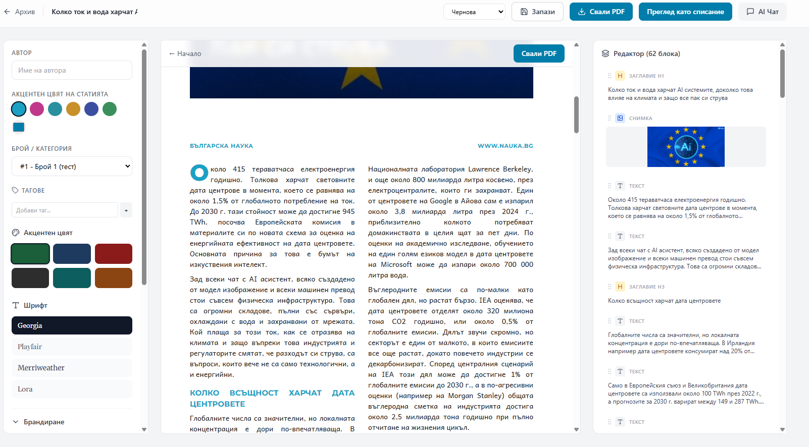

# Open Magazine Studio

**Turn a pasted or uploaded article into a consistent, print‑ready magazine PDF — no designer required.**

Open Magazine Studio is a free, open‑source web app for **NGOs, scientific
organisations, schools, and small publishers** who want professional‑looking
magazines and PDFs but don't have a graphic designer on hand. You paste your
text (from Google Docs or a Word `.docx`), and the app lays it out automatically
in a clean, uniform magazine design, organises articles into issues, and exports
a polished A4 PDF straight from your browser.

> The goal is **uniformity and ease**: the layout engine does ~90% of the design
> work by fixed rules, so every article in an issue looks consistent and
> professional, and you only fine‑tune the rest.



*Editing an issue in Open Magazine Studio: paste your article and the consistent „БГ Наука" magazine layout appears instantly (centre). Adjust the accent colour and content blocks on the left, use the optional AI editorial assistant on the right, and export to A4 PDF from the top bar.*

---

## ✨ Features

### Import

- **Paste from Google Docs** — Ctrl+A / Ctrl+C in the doc → Ctrl+V in the app.
  Bold, italic, underline, links, bulleted lists, headings (H1–H6) and images
  come across, including images placed inside a heading.
- **Upload a Word `.docx`** — embedded photos land where they were in the
  document (resolved through the document's relationships, so photos and
  captions stay paired), and Word lists become real bulleted lists.
- **Plain text** works too, as a fallback.
- **Images are compressed in the browser** and uploaded to Supabase Storage,
  with a progress indicator, so articles stay light.
- **Preview before saving** — an unsaved draft can be opened in the print view
  straight away.

### Automatic structure

Every block gets a role, so the layout knows what it is looking at:
**title, section heading (H2), subsection (H3), body text, bullet, pull quote,
references, image, advert.** Everything after a *"Използвани източници"*,
*"Източници"*, *"Литература"* or *"References"* heading becomes the references
block, with its URLs turned into links.

### Magazine layout

- **A4 pages** laid out by [Paged.js](https://pagedjs.org/), with a running
  header and page numbers.
- **Opener page** for every article: a full‑bleed photo with the title on it.
- **Two‑column justified body** with an optional coloured **drop cap**,
  section headings, bullets, pull quotes spanning both columns, and a
  references block.
- **Smart image defaults** — portrait photos stay inside a column, landscape
  and square ones span both.
- **Gap filling** — when a page ends with a wide photo or banner above an empty
  band, the photo grows (or the banner moves down) to absorb it, without
  disturbing the pagination.
- **Per‑article accent colour** — six presets or any custom colour; it tints the
  header, drop cap, headings, bullets, links and quotes.

### Article editor

- **Live preview identical to the PDF**, updated as you type.
- **Block editor** — text, heading, image, quote and advert blocks. Drag blocks
  to reorder, insert new ones between existing blocks, delete with confirmation.
- **Inline formatting** — bold (Ctrl+B), italic (Ctrl+I), underline (Ctrl+U)
  and links, per block.
- **Headings** as *H2 section* or *H3 subsection*; **text width** of one column
  or both; an **empty block** is a deliberate blank line.
- **Alignment** — left, centre, right or justified, for the whole article or a
  single block.
- **Image size** — Small, Medium, Large, Wide or Full width.
- **Links on images** — a click on the image opens the link, in the preview
  and in the PDF.
- **In‑article adverts** — one column, both columns, or a full page, each with
  an optional click‑through link.
- **Article details** — title (it lives in the first heading, so editing either
  updates the cover), author, tags and a status (*Draft / Ready / Exported*).
- **Cover photo** — automatic (first image of the article), uploaded, picked
  from the media library, or none.

### Issues

- **Home page lists every issue**, newest first, 20 per page, with
  **Active** and **Archive** tabs.
- **New issues are numbered automatically.**
- **Archive** an issue you started but won't finish: it leaves the home page,
  nothing is deleted, and one click brings it back.
- **Issue cover** as an image (uploaded or picked from the library) or a PDF.
- **Drag‑and‑drop ordering** of articles and adverts — drop anything straight
  into first, second or any place. The new order is saved in one atomic
  database call.
- **Full‑page adverts** between articles, each with an optional click‑through
  link.
- **Duplicate** an article into another issue, or **remove** it from an issue
  (it stays in the system as uncategorised).
- **Download** a single article or the **whole issue as one PDF**.

### Whole‑issue PDF

Cover page → auto‑generated **table of contents** (thumbnail, title and the
correct page number for every article, computed by the layout engine) →
articles and adverts in your order. **Links in the text, on images and on
adverts stay clickable in the PDF.**

### Media library

- **Every uploaded image, with where it is used** — image blocks, in‑article
  adverts, article covers, issue covers and full‑page adverts. The list is
  derived live from Storage and those usages, so it can never drift out of sync.
- **Filters** — all, used, unused, and by issue.
- **Reuse without copying** — picking an image points to the same file.
- **Clean up** — delete images nothing uses; an image still in use can't be
  deleted, and the library lists every place it appears.
- **Fast thumbnails** through Supabase's image transformation (a ~100 KB photo
  becomes a ~5 KB tile).
- Reachable from the issue page, the image/advert blocks, the cover picker and
  a **Library** button in the editor.

### All articles

A searchable list of every article (search by title or tag), filterable by
issue, including uncategorised ones, with quick issue creation.

### Optional AI editorial assistant

- **Chat panel** that sees the article and can **propose rewrites of specific
  blocks**; each proposal shows *before* and *after*, and you apply or reject
  it.
- **Per‑block AI rewrite** — give a free‑text instruction ("shorter", "more
  formal", …) for a single paragraph.
- **Any provider** — OpenAI‑compatible APIs (including **Ollama**) or Anthropic.
  Endpoint, API key, model, temperature, max tokens and system instructions are
  set in **Settings → AI**.
- Entirely optional: the app works fully without it.

### Branding

**Settings → Branding**: header and footer text, footer links, colour palette,
page numbers on/off and the header on all pages, with a live preview.

### PDF export

Uses the browser's native **Print → Save as PDF** (A4), so there is no heavy
server‑side rendering. The print button waits until fonts and images have
loaded and pagination has finished, so nothing gets clipped. A Playwright
script is included for headless exports.

---

## 🧩 How it works

```
paste / .docx  ─►  content blocks + roles  ─►  Paged.js (A4, magazine.css)  ─►  browser Print → PDF
                                                consistent design system
```

- **Front end:** React 18 + Vite + TypeScript, Tailwind CSS, react‑router‑dom,
  lucide‑react.
- **Pagination:** [Paged.js](https://pagedjs.org/) renders the content into A4
  pages with running headers, page numbers and a CSS‑driven design system.
- **Back end:** [Supabase](https://supabase.com) — Postgres (issues, articles,
  blocks, adverts, settings) + Storage (images). Two Deno **edge functions**
  power the optional AI assistant.
- **Tables** are prefixed `mag_pdf_*`.

---

## 🚀 Quick start

**Prerequisites:** Node.js 20+ and a Supabase project (the free tier or a
self‑hosted instance both work).

```bash
git clone https://github.com/petar-nauka/open-magazine-studio.git
cd open-magazine-studio
npm install
cp .env.example .env      # then fill in your Supabase URL + anon key
npm run dev               # http://localhost:5173
```

### 1. Configure environment

Create `.env` (copy from `.env.example`) with your Supabase project's URL and
**public anon key** (Settings → API in the Supabase dashboard). Never use the
`service_role` key in the front end. Both values are built into the bundle, so
changing them means rebuilding.

```
VITE_SUPABASE_URL=https://your-project.supabase.co
VITE_SUPABASE_ANON_KEY=your-anon-key
```

### 2. Set up the database (Supabase SQL editor)

Run **every** SQL file in `supabase/migrations/`, in date order — the app
expects all of them:

1. `20260531120000_mag_pdf_prefixed_schema.sql` — the tables
   (`mag_pdf_categories` = issues, `mag_pdf_articles`, `mag_pdf_content_blocks`,
   `mag_pdf_app_settings`).
2. `20260531130000_storage_images_bucket.sql` — the `mag_pdf_images` Storage
   bucket and its access policies.
3. `20260531140000_add_cover_pdf.sql` — PDF covers for issues.
4. `20260601120000_issue_inserts.sql` — `mag_pdf_issue_inserts` (full‑page
   adverts).
5. `20260712120000_replace_article_blocks_rpc.sql` — saves an article's blocks
   in one transaction.
6. `20260712130000_reorder_issue_items_rpc.sql` — reorders an issue in one
   transaction.
7. `20260823120000_storage_images_delete_policy.sql` — lets the media library
   delete unused images. Without it, Storage answers "success" and deletes
   nothing.
8. `20260923120000_issue_archive.sql` — archiving issues.
9. `20260925120000_issue_insert_links.sql` — links on full‑page adverts.

> **Security note:** the migrations ship with **permissive `anon` access** so the
> app works out of the box for a single user with no login. That includes the
> settings table where the AI provider's API key is stored, and the anon key is
> visible in the front‑end bundle. **Put the app behind authentication and
> tighten the RLS policies before any public or multi‑user deployment.**

### 3. (Optional) Enable the AI assistant

The AI chat and block‑rewrite features call Supabase **edge functions**
(`supabase/functions/ai-chat`, `rewrite-block`). Deploy them to your Supabase
project (e.g. with the Supabase CLI, or by placing them in your self‑hosted
edge‑runtime functions volume and restarting the service). Then open
**Settings → AI** in the app and enter your provider's endpoint, model and API
key (stored in the database, not in env; the functions read it with the
service role). Examples:

- **Ollama Cloud (OpenAI‑compatible):** endpoint `https://ollama.com/v1/chat/completions`, your model (e.g. `qwen3.5`), and an API key from `ollama.com/settings`.
- **OpenAI:** `https://api.openai.com/v1/chat/completions`, `gpt-4o-mini`, `sk-...`.
- **Anthropic:** `https://api.anthropic.com/v1/messages`, a Claude model.

### 4. Build / verify

```bash
npm run dev        # dev server
npm run build      # production build
npm run preview    # preview the build
npm run lint       # eslint
npm run typecheck  # tsc --noEmit
npm test           # vitest
```

---

## 🖨️ Exporting PDFs

Open an article (`/render?id=...`) or a whole issue (`/render?issue=...`) and
click **Свали PDF** (Download PDF) → your browser's print dialog → **Save as
PDF** (A4). The page CSS (`public/magazine.css`) defines the A4 page, margins,
running header and page numbers. An optional Playwright export script
(`npm run export:pdf -- <url> <out.pdf>`) is included for headless/automated
exports.

---

## 🎨 Customising the design

The look is driven by a small design system, easy to rebrand:

- **Header, footer, colours, page numbers** — in the app, under
  **Settings → Branding**.
- **Fonts** — bundled in `public/fonts/` (default: Montserrat + Andika).
- **Logos** — `public/brand/`.
- **Layout** — `public/magazine.css` (edit it to change how every article
  looks) and `src/design-system/`.
- **Accent palette** — `src/design-system/accent-list.ts`.

The default design ships configured for *Българска наука* (nauka.bg); swap the
fonts, logos and colours to make it your own.

---

## 🗺️ Status & roadmap

**Working today:** everything listed under [Features](#-features).

**Planned / nice‑to‑have:**

- Merge PDF covers into the single issue PDF with `pdf-lib` (today a PDF cover
  downloads separately; image covers and adverts are embedded).
- Duplicate detection on re‑save.
- Authentication and tighter RLS before multi‑user use.
- A smaller bundle (Paged.js makes it large).

---

## 🤝 Contributing

Issues and pull requests are welcome. Please run `npm run lint && npm run
typecheck && npm test && npm run build` before submitting. The UI text is in
**Bulgarian** — keep new user‑facing strings in Bulgarian.

## 📄 License

[MIT](./LICENSE) — free to use, modify and distribute. Built for the open
science and non‑profit community.

## 🙏 Acknowledgements

Created for [*Българска наука* (nauka.bg)](https://nauka.bg). Built with React,
Vite, Supabase and [Paged.js](https://pagedjs.org/).

---

## 🇧🇬 Накратко (Bulgarian)

**Open Magazine Studio** е безплатно приложение с отворен код, което превръща
поставена/качена статия (Google Docs или Word `.docx`) в **последователно,
готово за печат списание (PDF)** — **без нужда от дизайнер**. Подходящо за
**NGO, научни организации, училища и малки издатели**.

Поставяш текста → приложението го подрежда автоматично в чист списанийен дизайн
(цяла снимка‑начало, две колони, цветен инициал, подзаглавия, цитати), групира
статиите в **броеве** (с архив за недовършените), прави **автоматично
„Съдържание"** с номера на страниците, позволява **пълностранични реклами** и
**линкове върху реклами и снимки**, подреждане **с влачене**, **библиотека със
снимки** и тегли **PDF директно от браузъра** (Печат → Запази като PDF, A4). Има
и **по желание AI помощник** за редактиране на текст (работи с
OpenAI‑съвместими API като **Ollama**, или Anthropic).

Инсталация: `npm install` → копирай `.env.example` в `.env` и попълни Supabase
URL + anon ключ → пусни **всички** SQL миграции от `supabase/migrations/` в
Supabase → `npm run dev`. Пълният списък функции е по‑горе, на английски.
